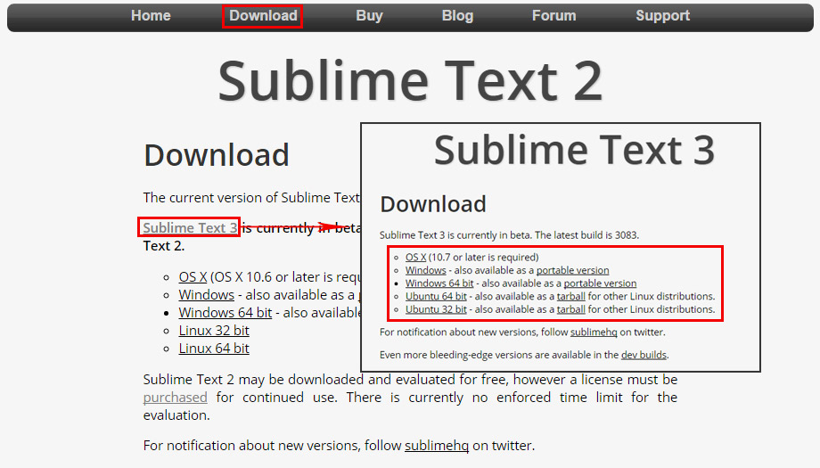

#Sublime Text3
코드 에디터(code editor)로 프로그래밍 언어를 작성 할 때 사용하며, 빠르고 가볍고 확정성이 좋다.

##다운로드
[http://www.sublimetext.com/](http://www.sublimetext.com/)

## 주요기능

- 프로젝트 관리 기능, 폴더 관리 용이
- GOTO 기능, 작업 파일로 빠르게 이동하여 화면을 쉽게 분할
- 패키지 관리, 많은 확장 기능 지원으로 확장기능 설치 제거가 용이
- 많은 단축키 지원 및 사용자 단축기 지정
  (vi의 단축키를 기본적으로 내장하여 vi스타일로 사용 가능)
- 매크로 기능
- 빌드 기능

## 사용자
- [설치]()
- [Package Control 설치]()
- [sublime - settings user]()
- [keymap user & shortcuts]()
- [사이드바와 프로젝트]()
- [Goto Anything]()
- [다중선택]()
- [레이아웃]()
- [패키지 - 확장기능 & 주요 Plugin List]()
- [빌드]()
- [매크로]()
- [vi]()
- [Snippet]()
- [Remove default Sublime Test 3 snippets (CSS)]()
- [Git을 이용하여 package 설치]()
- [terminal에서 subl 명령어로 Sublime-Text 실행하기]()

